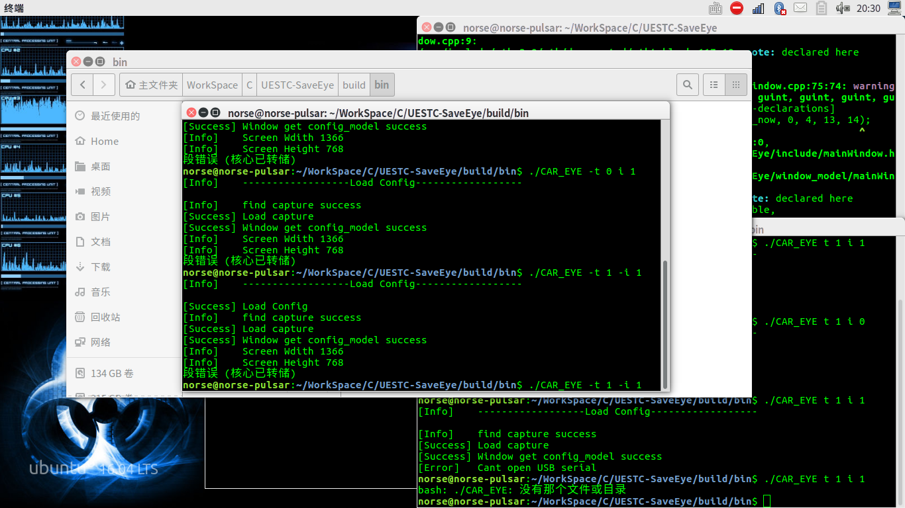
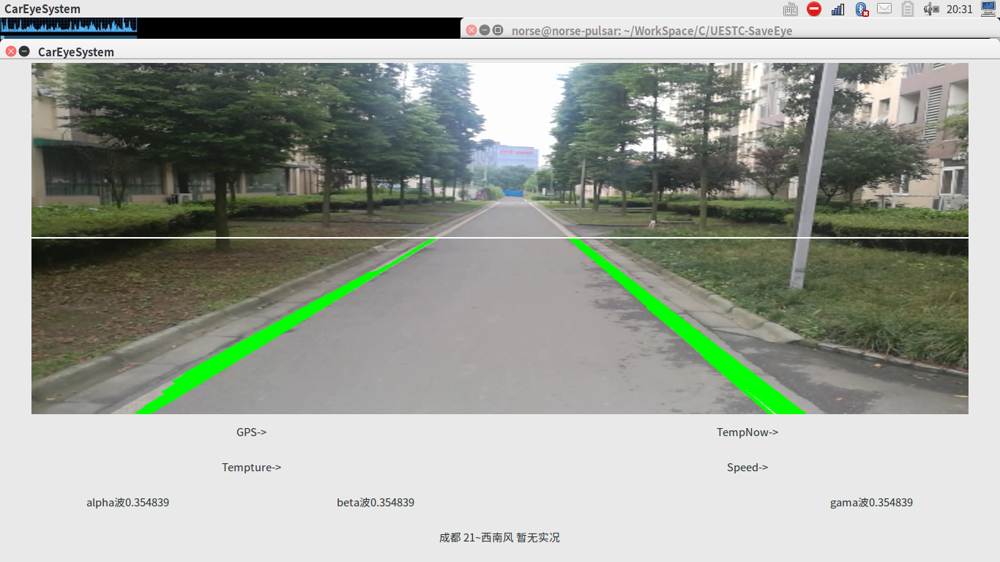
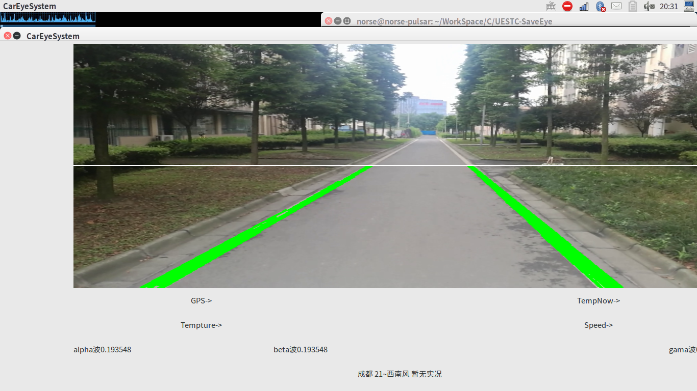

## 基于OpenCV3与GTK3+的车辆辅助驾驶系统
用于标准路面的偏移制导（带人物交通标志识别），可用于自动驾驶计算机视觉的入门学习和具体项目的二次开发  
克隆之前请确认好自己机子上面已经安装好下列库  
1. OpenCV 3.2
2. Serinal
3. CURL
4. ekho3.0
5. caffe2
  
  
  
下面的alpha beta gama是基于emotiv脑电波耳机开发的脑电辅助系统，部分代码不做开源，因此做了随机值填充，感兴趣开发脑电辅助（睡眠检测，酒驾检测，突发事件脑电感应，脑电控制等）驾驶控制的小伙伴也可以私我，欢迎来到科研的世界。  
### 开源协议[GPL](http://www.gnu.org/licenses/gpl-3.0.html)  
希望研究自动控制和自动驾驶的开源盆友一起研究跟新系统代码  
# 作者信息    
## Zhijia Tao
## QQ:2571440661
## 第二作者
## ZhenYu Ji
## QQ:804266219
## SiYu Yan
## QQ:2922528256
